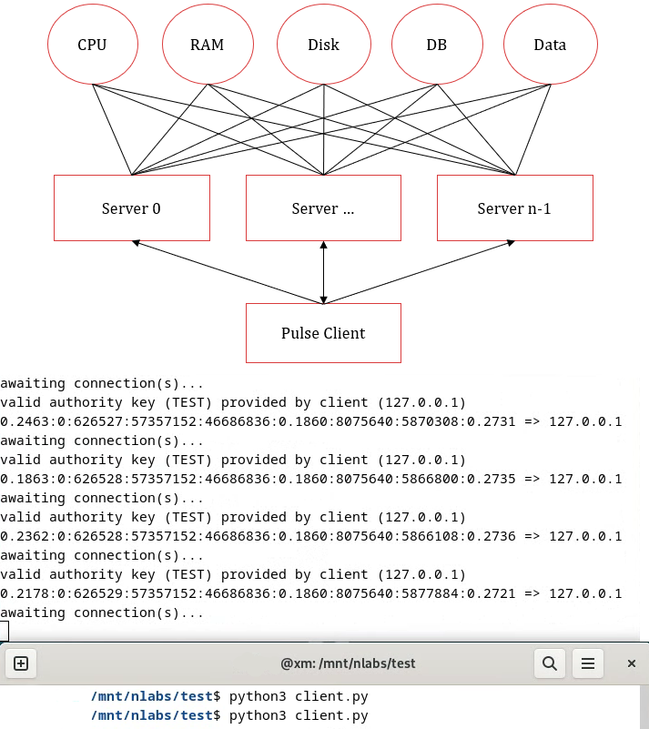

## Pulse

Cross platform server to return diagnostic metrics to clients which can periodically probe its instance over TCP/IP.



## Metrics

At present nine properties are processed by the server and are returned left-to-right separated by a ":" delimitor. These include:

| Index | Type   | Description                                       |
|:-----:|--------|---------------------------------------------------|
| 0     | double | cpu_load, a percentile within the interval [0, 1] |
| 1     | int    | database boolean flag, an int from the set {0, 1} |
| 2     | int    | number of uptime seconds defined using an integer |
| 3     | long   | disk space capacity relative to mount point       |
| 4     | long   | unoccupied diskspace available for io in bytes    |
| 5     | double | percentile of disk capacity currently written     |
| 6     | int    | total random access memory capacity               |
| 7     | int    | total random access memory freely available       |
| 8     | double | percentile of random access memory occupied       |

## List of Parameters

| Flag | Description                                                |
|:----:|------------------------------------------------------------|
| k    | overrides the default authority key using the command line |

## Authority Key Form

Perform the key override using the form:

```
./server -kREPLACE_WITH_YOUR_SECURITY_KEY
```

## Keyless Form

Omit the override by simply invoking the server without a key. By default, the server is keyless so use the authority key form ^ should it be desirable to do so.

```
./server
```

## Deployment Notes

Change (g_daemon_port) to match your organisations requirements.
